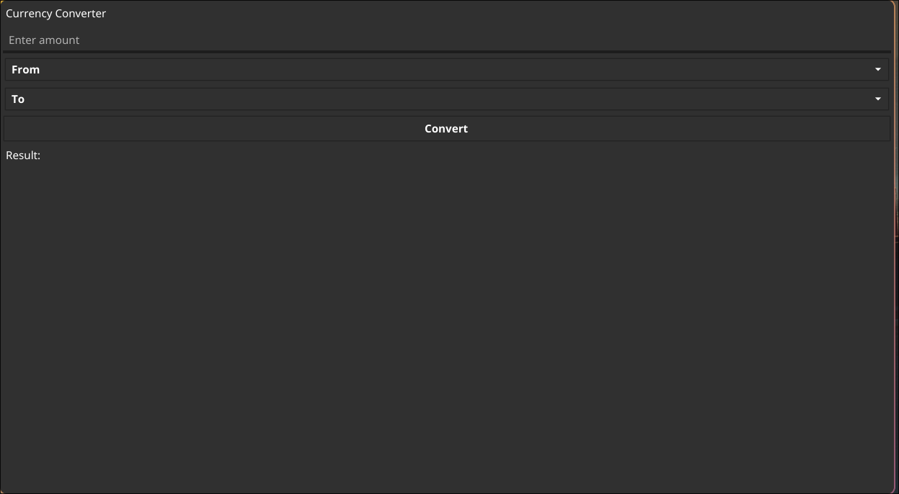

# Currency Converter

A simple desktop application built with the Fyne framework in Go for converting currencies between various options. This app fetches real-time exchange rates using a currency API and displays results in an easy-to-read format, including comma separators for large values.

## Features:

```plaintext
    Convert between multiple currencies: USD, EUR, GBP, CAD, VND.
    Automatically fetches the latest exchange rates via an API.
    Validates input and displays user-friendly error messages.
    Results are formatted with commas for readability if the value exceeds 1,000.
    Built with the Fyne framework for a responsive and user-friendly interface.
```

Screenshots

Main Interface:



## Installation

### Prerequisites

- Go: Ensure you have Go installed on your system. You can download it from https://golang.org/dl/.

### Instructions

- Clone the Repository:

```bash
git clone https://github.com/mhson281/currency-converter.git
cd currency-converter

```

- Install Dependencies

```bash
go mod tidy
```

- Run the Application

```bash
go run main.go
```

### Usage

- Enter the amount to be converted.
- Select the source currency (From).
- Select the target currency (To).
- Click the Convert button to calculate the converted value.
- The result will be displayed below, formatted with commas for better readability if the value is large.

Some screenshots for reference:


## Project Structure

```plaintext
currency-converter/
├── main.go         # Application entry point
├── api/
│   ├── api.go      # Handles fetching exchange rates from the API
├── ui/
│   ├── ui.go       # Defines the application UI components and layout
├── .env            # Environment file for API keys (not included in the repo)
├── go.mod          # Go module file
└── go.sum          # Go checksum file

```

## Configuration

Setting up the API Key:

- The app uses a currency exchange API to fetch the latest rates. Add your API key to the .env file in the root of the project:

```plaintext
API_KEY=your_api_key_here
```

- If you don’t have an API key, you can get one for free from [Open Exchange Rates](https://openexchangerates.org/):
  - Select `sign up` in the top right corner
  - Sign up for the always free plan
  - Log in with your newly created acount and generate the API key and plug it in the .env file

## Dependencies

- Fyne: Used to build the graphical user interface.
- GoDotEnv: Used to load environment variables.
- net/http: Used for making HTTP requests to the API.
- strconv: Used for parsing and formatting numeric values.

Install dependencies via go mod tidy.

## Future Improvements

- Add support for more currencies.
- Provide offline mode using locally cached rates.
- Add historical conversion rates and charts.
- Improve error handling and support rate-limiting for API requests.
